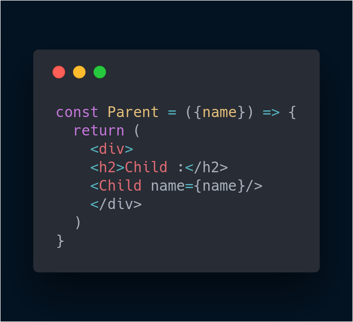

# learning Context API

Suppose we want to pass data from a parent component to a grandchild component,we have to pass it down through the child component as well.

This is where context API comes in handy.

## Without context

The App component renders Parent, which renders Child, which renders Grandchild. However, what's important to notice here is that the Grandchild component wants to render name -- but the data for name lives inside the App component.

Because Grandchild is so deeply nested, we have to pass the name prop one-by-one from App through all the components until it reaches Grandchild. What's more: we must do this even if any of the components along the way (Parent and Child) aren't even concerned with the name data!

This process of "threading props" to send data to a child component can be tiresome, and perhaps even error-prone. Luckily, we can avoid it with React's Context API.

`App` component  

`Parent` component  

`Child` component  

`Grandchild` component  

Now we can display the name through the grandchild component  

##  With context api

Now let's take a look at how context api helps us to pass data only to the component which requires the specific data.  

To begin, we'll use React's createContext() function to return an object with a Provider as well as a Consumer.

**Creating context**  

  

context api has two properties : **provider** and **consumer**

The Provider component is used in the upper level of the component tree; that is, the component from which the data to be passed is held. In our case, this was the App component. We passed the name data as the value of Provider's value prop:

On the receiving end (i.e., a component "under" the Provider in the component hierarchy), we use the Consumer component. In our example, we passed Consumer a function as a child. This function accepts a value and returns some JSX:

As a result, we were able to render the Grandchild component with the correct name data without ever having to pass that data down the entire component thread! That's a lot less code than the previous way we had to do it. So React's Context API provides a terse, approachable way to easily communicate information from one component to another.

Let's take a look at our app now.

Voila! It works!!  

  

And we don't have to pass the data as props down the parent and child components anymore!!  

  

